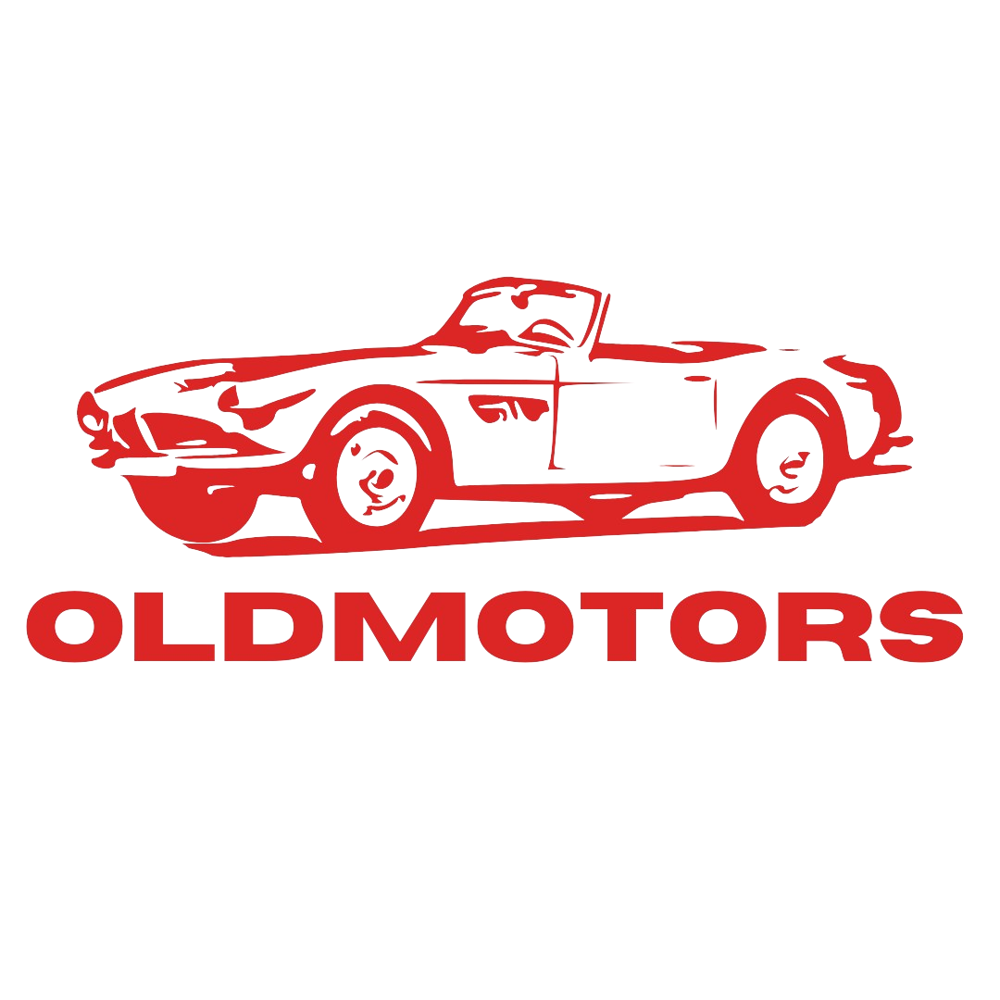

<!--  -->

# Old Motors

Encontre carros nostálgicos em poucos cliques.

## 🎯 Objetivo do projeto

Projeto pessoal desenvolvido com o objetivo de praticar PHP moderno,
Docker e modelagem de aplicações CRUD com upload de imagens.

## 🪧 Status

Em desenvolvimento.

## ✅ Funcionalidades

### Vendedor

- Cadastro de veículos com imagens
- Atualização de dados e imagens de veículos
- Exclusão de veículos

### Administrador

- Cadastro de usuários
- Atualização de dados de usuários (via admin)
- Exclusão de usuários (via admin)

## 🛠️ Tecnologias

- HTML
- CSS
- Sass
- JavaScript
- PHP
- MySQL
- Docker

## 📝 Requisitos

- PHP >= 8.4
- Docker
- Docker Compose

## 🚀 Como rodar o projeto?

```bash

# clone o repositório
git clone https://github.com/gmmbr10/old-motors.git

# entre na pasta
cd old-motors/src

# crie uma pasta chamada storage
mkdir storage

# entre nesta pasta e crie outra pasta chamada vehicles
cd storage
mkdir vehicles

# retorne a pasta raiz do projeto
cd ../..

# execute o programa
docker compose up --build -d

# liste os containers em execução
docker ps

# entre no container do banco de dados
docker container exec -ti id-do-container mysql -u root -p

# execute o conteúdo do arquivo sql/database.sql

# saia do container
exit

```

## 📄 Licença

Este projeto está sob a licença MIT.
